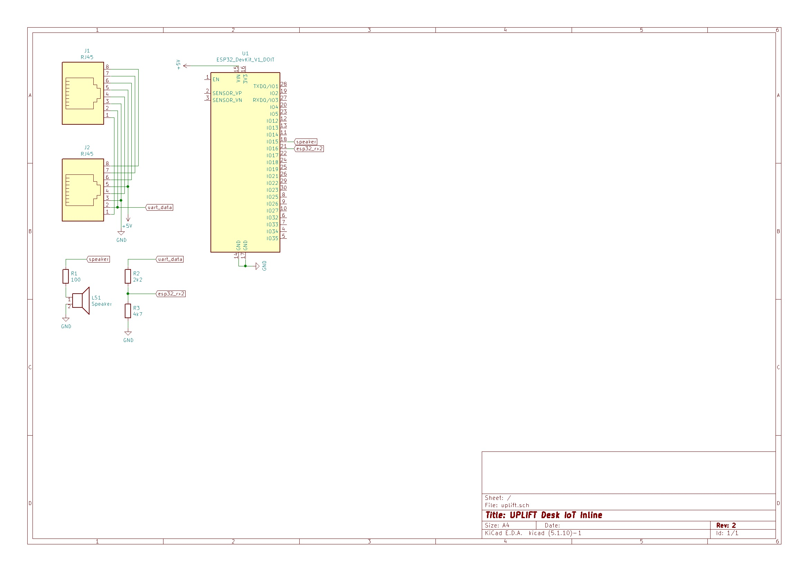

# UPLIFT-IoT
Connecting an [UPLIFT](https://www.upliftdesk.com/) desk to Home Assistant using and ESP32 with ESP Home for Home Assistant.

## Disclaimer
This is an adersarial interop against a hardware interface. Any changes from the manufacturer could invalidate or even make this dangerous. Validate assumptions on your own system and proceed with caution. 

## Usage
The UART driver for ESP Home should work without modification. Everything else will need to be customized to your setup using the provided examples.

## ESP Home
An ESP32 is used with [ESP Home](https://esphome.io/). The specific board is a esp32doit-devkit-v1.
### esphome/uplift_uart.h
Custom UART driver that interprets the data from the UPLift desk unit.
### uplift-iot.yaml
An example definition for the device in ESPHome. Will need to be customized to be used.

## Home Assistant
Data is consumed by [Home Assistant](https://www.home-assistant.io/).
### homeassistant/automation.yaml 
An example automation which will need to be cusomized to be used.

## PCB / Board
[KiCAD](https://www.kicad.org/) files for a PCB are included for anyone that would like to produce their own. Here is the schematic if you'd like to breadboard it.

## Enclosure
[OpenSCAD](https://openscad.org/) files for an enclosure are included for 3D printing. The default values are good even if you use a header to connect the ESP to the board. Use M3x4mm screws to attach the PCB. The lid will snap fit. The [BOSL2 library](https://github.com/revarbat/BOSL2) is used and included along with it's license file.

## Details
### UPLIFT Wiring
On My UPLIFT Desk, the keypad communicates with the motor box via an ethernet cable. A logic analyser shows that the second wire has a digital signal at 9600 baud. The third wire is ground, and the fifth is a 5v supply. All the others get pulled low by the keypad when buttons are pressed.
### Signal Analysis
I don't want remote control of the motors, so my analysis is focused exlusively on the serial data on line 2. The data only sends few a short period after the desk height changes, then goes dead. This isn't a problem, but is good to know when doing analysis. Starting with defaults for parity, stop bits, and data length produced the data sequence 1, 1, [0,1], [0-255] repeating. The format is big endian, so the first integer is always 257 and the second is the real data. It is sending the height in tenths of an inch, so 296 is 29.6".
### UART Driver
A simple approach is used for such a simple use case. We look for the expected 1,1 data sequence and then process the next two bytes. It is possible to get out of sequence when the desk is higher than 25.5" so if the first byte is not a 0 or 1, the logic resets to avoid non-sensical readings like 1000". This allows up to 51.1" to be expressed, and my desk only goes up to 50.8".